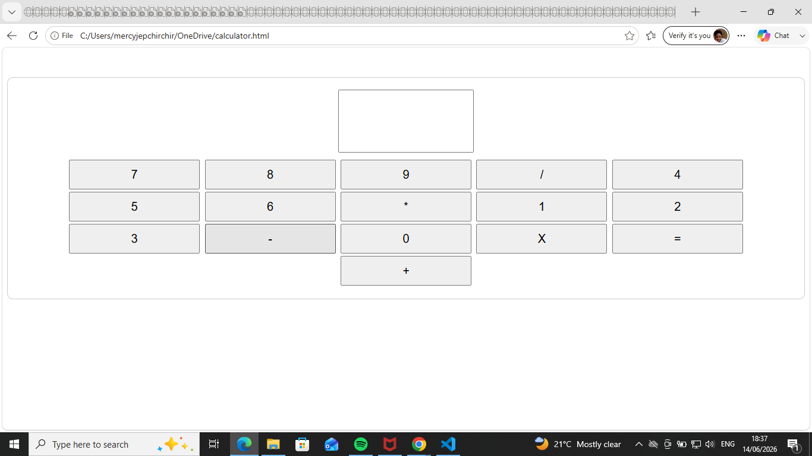

# calculator# Calculator Website

## Description
This is a simple calculator created using HTML, CSS, and JavaScript. It performs basic arithmetic operations such as addition, subtraction, multiplication, and division.

## Features
- Basic arithmetic calculations
- Clean and simple user interface
- Clear display button
- Error handling for invalid expressions

## Technologies Used
- HTML
- CSS
- JavaScript

## Screenshot



## How to Run

1. Download or clone this repository.
2. Open the project folder.
3. Open `index.html` in your web browser.

## Project Files

```
calculator-project/
│
├── index.html
├── README.md
└── screenshot.png
```

## Author

Mercy Jepchirchir
